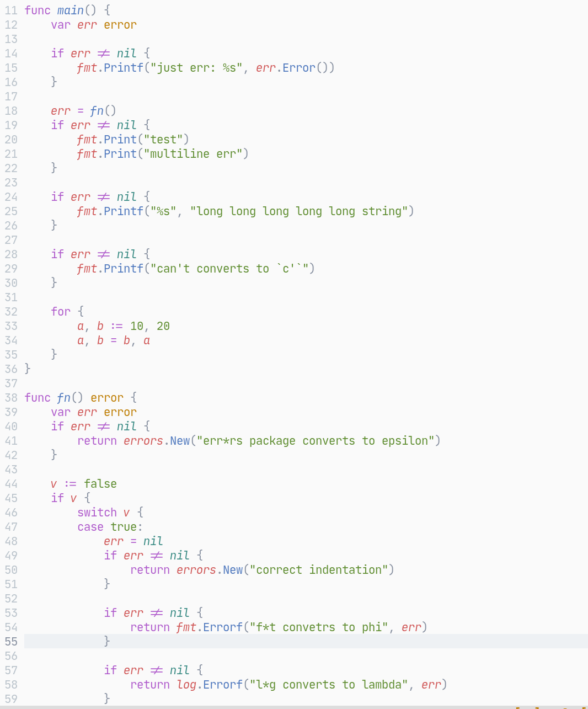
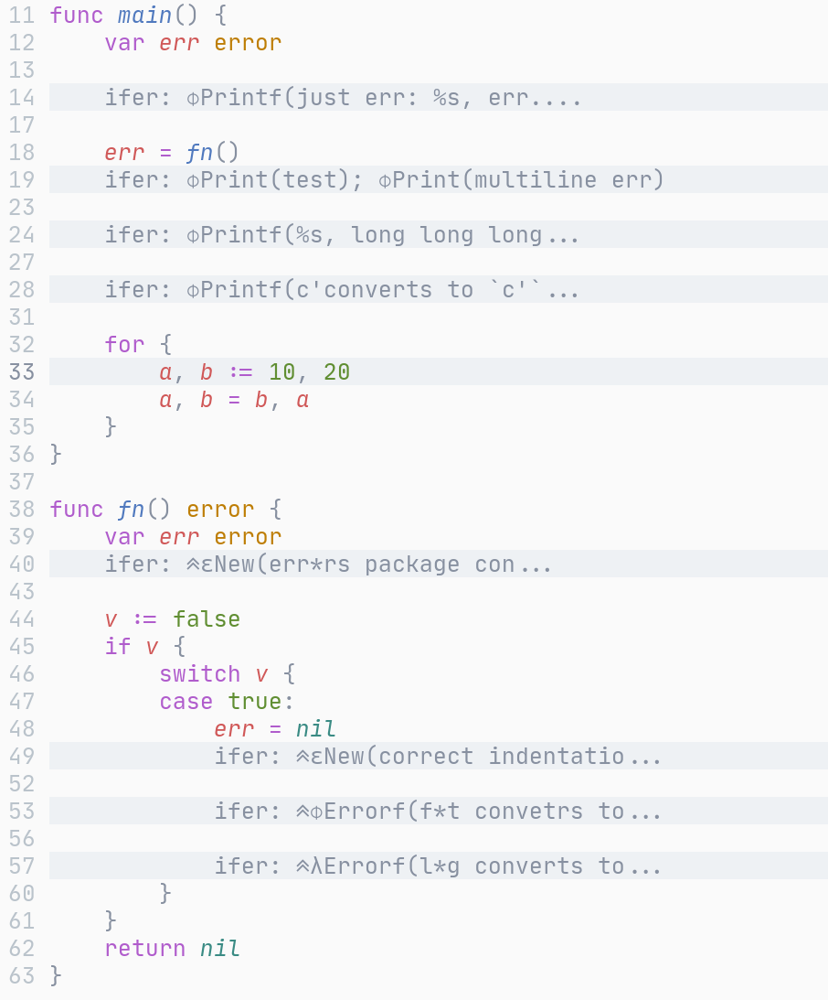

# goerr-nvim
The plugin folds Go's `if err != nil` and shows other lines like in Goland, it greatly reduces code length and doesn't affect readability.  

The plugin converts popular words that is used in handling errors to just Greek letters.  
Also it folds errors on buffer enter, and remove dots in folding.  

__Before:__

__After:__

## Installation
1. Install it with your favorite plugin manager
2. Make sure you set `syntax on` and `set foldmethod=syntax`, since this plugin closes folds based on syntax. 
    - If you think of the better way of creating and closing folds, make me know in an issue or PR :)
3. The plugin uses `softtabstop` setting under the cover. If the indentation level isn't right, you can adjust the setting accordingly or contribute to the plugin development :)

## Features
- Auto close `if err != nil` blocks of code, show inner lines;
- Remove distracted dots via `'fillchars'`;
- Truncate long inner lines;
- Change `return` to 1 Unicode symbol (arrows);
- Change `log` and `logger` to lambda;
- Change `can't`, `cannot`, `can not` to just `c'`;
- Change `fmt` and `errors` to phi and epsilon respectively.

## TODO
- Add parameters for this stuff;
- Handle long `if`'s.
